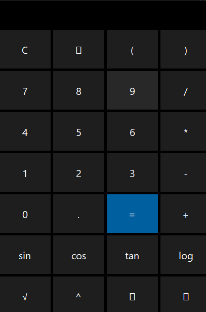

# 🧮 Calculadora Científica com Gráfico - Java Swing

Uma calculadora científica moderna com visual escuro e suporte a gráfico de funções, desenvolvida em Java com Swing e JFreeChart.



---

## ✨ Recursos

- Interface gráfica com tema escuro (estilo calculadora do Windows)
- Operações básicas e científicas:
    - `+`, `-`, `*`, `/`, `()`, `√`, `^`
    - `sin`, `cos`, `tan`, `log`
- Suporte a expressões matemáticas complexas
- Teclas adicionais:
    - `C` (limpa tudo)
    - `⌫` (apaga último caractere)
    - `📈` (abre gráfico da função)
    - `✕` (fecha a calculadora)
- Janela **sem barra de título**, mas **arrastável com o mouse**
- Gráfico personalizável com entrada de função `f(x)` como `Math.sin(x)`, `x*x`, etc.

---

## 🚀 Como executar

### 1. Requisitos

- Java 8 ou superior
- Gradle (ou use o `./gradlew` incluso)

### 2. Clonar o projeto

```bash
git clone https://github.com/GabriellMartins/Calculator.git
cd Calculator
